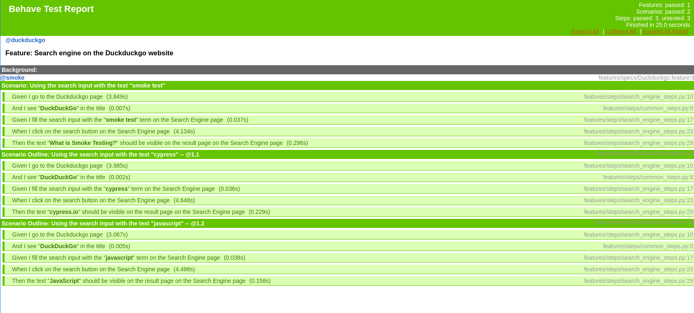

[](https://github.com/prettier/prettier)

# BDD base project: Python + Behave

Basic example of using Python with Behave (BDD). This `Gherkin` example includes:
- Basic Scenario
- Scenario Outline
- Tagged tests

# Table of contents

* [Get started](#get-started)
  * [Installation](#installation)
* [How to run the tests](#how-to-run-the-tests)
  * [Running tests](#running-tests)
  * [Running tests and generate Allure report](#running-tests-and-generate-allure-report)
    * [Open Allure report](#open-allure-report)
  * [Running tagged tests](#running-tagged-tests)
    * [Running tagged smoke tests](#running-tagged-smoke-tests)
    * [Running using customized tags](#running-using-customized-tags)
  * [Change Browser](#change-browser)
  * [Change Headless mode](#change-headless-mode)
* [Static code analysis tools](#static-code-analysis-tools)
  * [Set up the Git hooks custom directory](#set-up-the-git-hooks-custom-directory)
  * [Python Static Checkers](#python-static-checkers)
  * [Shell Static Checkers](#shell-static-checkers)
  * [Run manually](#run-manually)
* [License](#license)

# Get started

## Installation

```bash
python3 -m pip install -r requirements.txt
```

# How to run the tests

## Running tests

```bash
python3 -m behave
```

```gherkin
@duckduckgo
Feature: Search engine on the Duckduckgo website # features/specs/Duckduckgo.feature:2

  Background:   # features/specs/Duckduckgo.feature:4

  @smoke
  Scenario: Using the search input with the text "smoke test"                                             # features/specs/Duckduckgo.feature:9
    Given I go to the Duckduckgo page                                                                     # features/steps/search_engine_steps.py:10 3.849s
    And I see "DuckDuckGo" in the title                                                                   # features/steps/common_steps.py:8 0.007s
    Given I fill the search input with the "smoke test" term on the Search Engine page                    # features/steps/search_engine_steps.py:17 0.037s
    When I click on the search button on the Search Engine page                                           # features/steps/search_engine_steps.py:23 4.134s
    Then the text "What is Smoke Testing?" should be visible on the result page on the Search Engine page # features/steps/search_engine_steps.py:29 0.298s

  Scenario Outline: Using the search input with the text "cypress" -- @1.1                    # features/specs/Duckduckgo.feature:21
    Given I go to the Duckduckgo page                                                         # features/steps/search_engine_steps.py:10 3.985s
    And I see "DuckDuckGo" in the title                                                       # features/steps/common_steps.py:8 0.002s
    Given I fill the search input with the "cypress" term on the Search Engine page           # features/steps/search_engine_steps.py:17 0.036s
    When I click on the search button on the Search Engine page                               # features/steps/search_engine_steps.py:23 4.648s
    Then the text "cypress.io" should be visible on the result page on the Search Engine page # features/steps/search_engine_steps.py:29 0.229s

  Scenario Outline: Using the search input with the text "javascript" -- @1.2                 # features/specs/Duckduckgo.feature:22
    Given I go to the Duckduckgo page                                                         # features/steps/search_engine_steps.py:10 3.067s
    And I see "DuckDuckGo" in the title                                                       # features/steps/common_steps.py:8 0.005s
    Given I fill the search input with the "javascript" term on the Search Engine page        # features/steps/search_engine_steps.py:17 0.038s
    When I click on the search button on the Search Engine page                               # features/steps/search_engine_steps.py:23 4.498s
    Then the text "JavaScript" should be visible on the result page on the Search Engine page # features/steps/search_engine_steps.py:29 0.158s

1 feature passed, 0 failed, 0 skipped
3 scenarios passed, 0 failed, 0 skipped
15 steps passed, 0 failed, 0 skipped, 0 undefined
Took 0m24.990s
```

**HTML report**:




## Running tagged tests

### Running tagged smoke tests

```bash
python3 -m behave --tags=smoke
```

### Running using customized tags

```bash
python3 -m behave --tags='<EXPRESSION>'
```

*more details*: [running-tagged-tests](https://jenisys.github.io/behave.example/tutorials/tutorial11.html)

## Change Browser

edit **`behave.ini`**:

```ini
...

[behave.userdata]
browser = firefox  # <- CHANGE HERE - Available options: firefox | chrome

...
```

## Change Headless mode

edit **`behave.ini`**:

```ini
...

[behave.userdata]
headless = true  # <- CHANGE HERE - Available options: true | false

...
```

# Static code analysis tools

These are the linters that will help us to follow good practices and style guides of our source code. We will be using
the following static analysis tools, which will be executed when generating a new push in the repository (git hooks).

## Set up the Git hooks custom directory

After cloning the repository run the following command in the repository root:

```bash
git config core.hooksPath .githooks
```

## Python Static Checkers

Tools used:
- [brunette](https://github.com/odwyersoftware/brunette): A best practice Python code formatter.
- [isort](https://pycqa.github.io/isort/): Python utility / library to sort imports alphabetically, and automatically
  separated into sections and by type.
- [prospector](https://github.com/PyCQA/prospector): Prospector is a tool to analyse Python code and output information
  about errors, potential problems, convention violations and complexity.

  Tools executed by Prospector:
  - [pylint](https://github.com/PyCQA/pylint): Pylint is a Python static code analysis tool which looks for programming
    errors, helps enforcing a coding standard, sniffs for code smells and offers simple refactoring suggestions.
  - [bandit](https://github.com/PyCQA/bandit): Bandit is a tool designed to find common security issues.
  - [dodgy](https://github.com/landscapeio/dodgy): It is a series of simple regular expressions designed to detect
    things such as accidental SCM diff checkins, or passwords or secret keys hard coded into files.
  - [mccabe](https://github.com/PyCQA/mccabe): Complexity checker.
  - [mypy](https://github.com/python/mypy): Mypy is an optional static type checker for Python.
  - [pydocstyle](https://github.com/PyCQA/pydocstyle): pydocstyle is a static analysis tool for checking compliance
    with Python [PEP 257](https://peps.python.org/pep-0257/).
  - [pycodestyle](https://pycodestyle.pycqa.org/en/latest/): pycodestyle is a tool to check your Python code against
    some of the style conventions in [PEP 8](https://peps.python.org/pep-0008/).
  - [pyflakes](https://github.com/PyCQA/pyflakes): Pyflakes analyzes programs and detects various errors.
  - [pyroma](https://github.com/regebro/pyroma): Pyroma is a product aimed at giving a rating of how well a Python
    project complies with the best practices of the Python packaging ecosystem, primarily PyPI, pip, Distribute etc,
    as well as a list of issues that could be improved.

## Shell Static Checkers

Tools used:
- [shellcheck](https://www.shellcheck.net/): Finds bugs in your shell scripts (bash).

  Installation:

  ```bash
  apt install shellcheck
  ```

## Run manually

```bash
bash scripts/code_checkers.sh
```

# License

[MIT](./LICENSE)
