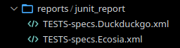
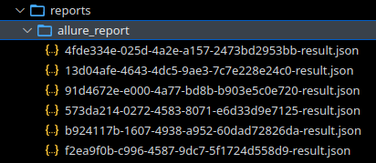
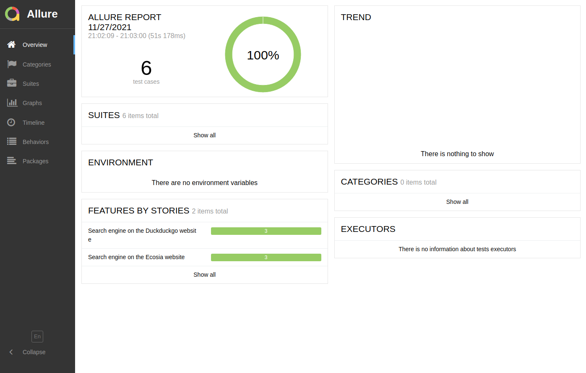

[](https://github.com/prettier/prettier)

# BDD base project: Python + Behave

Basic example of using Python with Behave (BDD). This `Gherkin` example includes:
- Basic Scenario
- Scenario Outline
- Tagged tests

# Table of contents

* [Get started](#get-started)
  * [Installation](#installation)
* [How to run the tests](#how-to-run-the-tests)
  * [Running tests](#running-tests)
  * [Running tests and generate Allure report](#running-tests-and-generate-allure-report)
    * [Open Allure report](#open-allure-report)
  * [Running tagged tests](#running-tagged-tests)
    * [Running tagged smoke tests](#running-tagged-smoke-tests)
    * [Running using customized tags](#running-using-customized-tags)
  * [Change Browser](#change-browser)
  * [Change Headless mode](#change-headless-mode)
* [Static code analysis tools](#static-code-analysis-tools)
  * [Find Problems](#find-problems)
* [Testing](#testing)
* [License](#license)
* [Changelog](#changelog)

# Get started

## Installation

```bash
pip3 install -r requirements.txt
```

on Ubuntu 20.04 (**`pyvirtualdisplay`** requirements, we use **`pyvirtualdisplay`** to avoid
Cloudflare errors in headless mode):

```bash
sudo apt-get install xvfb xserver-xephyr tigervnc-standalone-server xfonts-base
```

# How to run the tests

## Running tests

```bash
behave
```

```bash
2 features passed, 0 failed, 0 skipped
6 scenarios passed, 0 failed, 0 skipped
30 steps passed, 0 failed, 0 skipped, 0 undefined
Took 0m50.056s
```

- **`./reports/ folder`**:

  


## Running tests and generate Allure report

```bash
behave -f allure -o reports/allure_report/
```

- **`./reports/ folder`**:

  


### Open Allure report

**`Note`**: [allure](https://docs.qameta.io/allure/) is required.

```bash
allure serve reports/allure_report/
```

HTML report:




## Running tagged tests

### Running tagged smoke tests

```bash
behave --tags=smoke
```

### Running using customized tags

```bash
behave --tags='<EXPRESSION>'
```

*more details*: [running-tagged-tests](https://jenisys.github.io/behave.example/tutorials/tutorial11.html)

## Change Browser

edit **`behave.ini`**:

```ini
...

[behave.userdata]
browser=firefox  # <- CHANGE HERE - Available options: firefox | chrome

...
```

## Change Headless mode

edit **`behave.ini`**:

```ini
...

[behave.userdata]
headless = true  # <- CHANGE HERE - Available options: true | false

...
```

# Static code analysis tools

## Find Problems

Checkers statically analyzes the code to find problems.

```bash
bash code_checkers.sh  # run pylint, prospector, black and isort
```

Tools used:
- [pylint](https://github.com/PyCQA/pylint): Pylint is a Python static code analysis tool which looks for programming errors, helps enforcing a coding standard, sniffs for code smells and offers simple refactoring suggestions.
- [black](https://github.com/psf/black): Black is the uncompromising Python code formatter.
- [isort](https://pycqa.github.io/isort/): Python utility / library to sort imports alphabetically, and automatically separated into sections and by type.
- [prospector](https://github.com/PyCQA/prospector): Prospector is a tool to analyse Python code and output information about errors, potential problems, convention violations and complexity.

  Tools executed by Prospector:
  - [bandit](https://github.com/PyCQA/bandit): Bandit is a tool designed to find common security issues.
  - [dodgy](https://github.com/landscapeio/dodgy): It is a series of simple regular expressions designed to detect things such as accidental SCM diff checkins, or passwords or secret keys hard coded into files.
  - [mccabe](https://github.com/PyCQA/mccabe): Complexity checker.
  - [mypy](https://github.com/python/mypy): Mypy is an optional static type checker for Python.
  - [pep257](https://github.com/PyCQA/pydocstyle): pep257 is a static analysis tool for checking compliance with Python PEP 257.
  - [pep8](https://pep8.readthedocs.io/en/release-1.7.x/): pep8 is a tool to check your Python code against some of the style conventions in PEP 8.
  - [pyflakes](https://github.com/PyCQA/pyflakes): Pyflakes analyzes programs and detects various errors.
  - [pyroma](https://github.com/regebro/pyroma): Pyroma is a product aimed at giving a rating of how well a Python project complies with the best practices of the Python packaging ecosystem, primarily PyPI, pip, Distribute etc, as well as a list of issues that could be improved.

# Testing

We use **`tox`** to validate changes on linux OS (headless mode):

```bash
tox
```

**`output`**:

```bash
...

2 features passed, 0 failed, 0 skipped
6 scenarios passed, 0 failed, 0 skipped
30 steps passed, 0 failed, 0 skipped, 0 undefined
Took 0m43.177s
_____________________________________________ summary _____________________________________________
  code_checkers: commands succeeded
  py36: commands succeeded
  py37: commands succeeded
  py38: commands succeeded
  py39: commands succeeded
  congratulations :)
```

to validate changes for a particular Python version (**`36`**, **`37`**, **`38`** or **`39`**), you can do:

```bash
tox -e py36
```

# License

[MIT](./LICENSE)

# Changelog

- 1.0.0 - Initial release.
